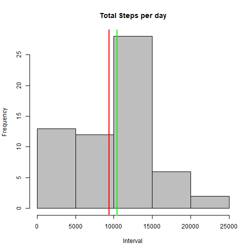
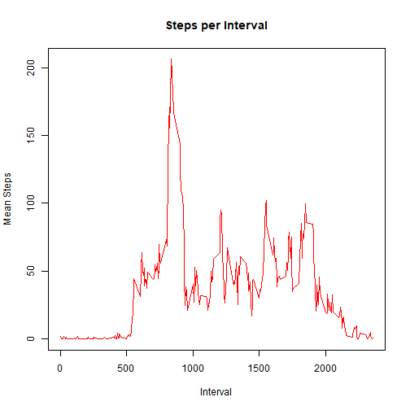
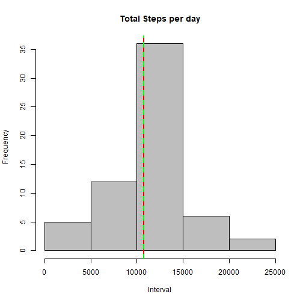
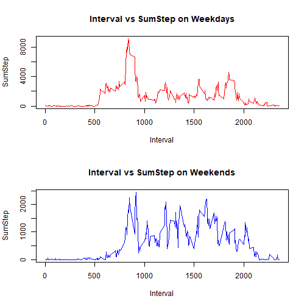

## 1. Code for reading in the dataset and/or processing the data

```r
out.df<-read.csv("activity.csv",sep=",")
str(out.df)
```

```
## 'data.frame':	17568 obs. of  3 variables:
##  $ steps   : int  NA NA NA NA NA NA NA NA NA NA ...
##  $ date    : Factor w/ 61 levels "2012-10-01","2012-10-02",..: 1 1 1 1 1 1 1 1 1 1 ...
##  $ interval: int  0 5 10 15 20 25 30 35 40 45 ...
```

```r
out.df$date<-as.Date(out.df$date,format='%Y-%m-%d')
```

## 2. Histogram of the total number of steps taken each day

```r
stepsPerDay<-tapply(out.df$steps,out.df$date, sum, na.rm=TRUE)
hist(stepsPerDay, col="grey", xlab="Interval",main="Total Steps per day")
abline(v = mean(stepsPerDay), col="red",lwd=2)
abline(v = median(stepsPerDay), col="green",lwd=2)
```


## 3. Mean and median number of steps taken each day

```r
meanStepsByDate<-tapply(out.df$steps,out.df$date, mean, na.rm=TRUE)
medianStepsByDate<-tapply(out.df$steps,out.df$date, median,na.rm=TRUE)
cbind(meanStepsByDate,medianStepsByDate)
```

```
##            meanStepsByDate medianStepsByDate
## 2012-10-01             NaN                NA
## 2012-10-02       0.4375000                 0
## 2012-10-03      39.4166667                 0
## 2012-10-04      42.0694444                 0
## 2012-10-05      46.1597222                 0
## 2012-10-06      53.5416667                 0
## 2012-10-07      38.2465278                 0
## 2012-10-08             NaN                NA
## 2012-10-09      44.4826389                 0
## 2012-10-10      34.3750000                 0
## 2012-10-11      35.7777778                 0
## 2012-10-12      60.3541667                 0
## 2012-10-13      43.1458333                 0
## 2012-10-14      52.4236111                 0
## 2012-10-15      35.2048611                 0
## 2012-10-16      52.3750000                 0
## 2012-10-17      46.7083333                 0
## 2012-10-18      34.9166667                 0
## 2012-10-19      41.0729167                 0
## 2012-10-20      36.0937500                 0
## 2012-10-21      30.6284722                 0
## 2012-10-22      46.7361111                 0
## 2012-10-23      30.9652778                 0
## 2012-10-24      29.0104167                 0
## 2012-10-25       8.6527778                 0
## 2012-10-26      23.5347222                 0
## 2012-10-27      35.1354167                 0
## 2012-10-28      39.7847222                 0
## 2012-10-29      17.4236111                 0
## 2012-10-30      34.0937500                 0
## 2012-10-31      53.5208333                 0
## 2012-11-01             NaN                NA
## 2012-11-02      36.8055556                 0
## 2012-11-03      36.7048611                 0
## 2012-11-04             NaN                NA
## 2012-11-05      36.2465278                 0
## 2012-11-06      28.9375000                 0
## 2012-11-07      44.7326389                 0
## 2012-11-08      11.1770833                 0
## 2012-11-09             NaN                NA
## 2012-11-10             NaN                NA
## 2012-11-11      43.7777778                 0
## 2012-11-12      37.3784722                 0
## 2012-11-13      25.4722222                 0
## 2012-11-14             NaN                NA
## 2012-11-15       0.1423611                 0
## 2012-11-16      18.8923611                 0
## 2012-11-17      49.7881944                 0
## 2012-11-18      52.4652778                 0
## 2012-11-19      30.6979167                 0
## 2012-11-20      15.5277778                 0
## 2012-11-21      44.3993056                 0
## 2012-11-22      70.9270833                 0
## 2012-11-23      73.5902778                 0
## 2012-11-24      50.2708333                 0
## 2012-11-25      41.0902778                 0
## 2012-11-26      38.7569444                 0
## 2012-11-27      47.3819444                 0
## 2012-11-28      35.3576389                 0
## 2012-11-29      24.4687500                 0
## 2012-11-30             NaN                NA
```
## 4. Time series plot of the average number of steps taken

```r
meanStepsByInterval<-tapply(out.df$steps,out.df$interval,mean,na.rm=TRUE)
df<-data.frame(meanStepsByInterval)

#plot(unique(out.df$interval),meanStepsByInterval,type="l",main = "Steps per Interval", xlab= "Interval", ylab= "Mean Steps", col="red" ,lwd=1)
plot(rownames(df),df$meanStepsByInterval,type="l",main = "Steps per Interval", xlab= "Interval", ylab= "Mean Steps", col="red" ,lwd=1)
```


## 5. The 5-minute interval that, on average, contains the maximum number of steps

```r
df[df$meanStepsByInterval==max(df$meanStepsByInterval),]
```

```
##      835 
## 206.1698
```
## 6. Strategy for imputing missing data

```r
new.df<-out.df
new.df$steps[which(is.na(new.df$steps))]<-mean(out.df$steps,na.rm=TRUE)

meanStepsByDateImp<-tapply(new.df$steps,new.df$date, mean)
medianStepsByDateImp<-tapply(new.df$steps,new.df$date, median,na.rm=TRUE)
cbind(meanStepsByDateImp,medianStepsByDateImp)
```

```
##            meanStepsByDateImp medianStepsByDateImp
## 2012-10-01         37.3825996              37.3826
## 2012-10-02          0.4375000               0.0000
## 2012-10-03         39.4166667               0.0000
## 2012-10-04         42.0694444               0.0000
## 2012-10-05         46.1597222               0.0000
## 2012-10-06         53.5416667               0.0000
## 2012-10-07         38.2465278               0.0000
## 2012-10-08         37.3825996              37.3826
## 2012-10-09         44.4826389               0.0000
## 2012-10-10         34.3750000               0.0000
## 2012-10-11         35.7777778               0.0000
## 2012-10-12         60.3541667               0.0000
## 2012-10-13         43.1458333               0.0000
## 2012-10-14         52.4236111               0.0000
## 2012-10-15         35.2048611               0.0000
## 2012-10-16         52.3750000               0.0000
## 2012-10-17         46.7083333               0.0000
## 2012-10-18         34.9166667               0.0000
## 2012-10-19         41.0729167               0.0000
## 2012-10-20         36.0937500               0.0000
## 2012-10-21         30.6284722               0.0000
## 2012-10-22         46.7361111               0.0000
## 2012-10-23         30.9652778               0.0000
## 2012-10-24         29.0104167               0.0000
## 2012-10-25          8.6527778               0.0000
## 2012-10-26         23.5347222               0.0000
## 2012-10-27         35.1354167               0.0000
## 2012-10-28         39.7847222               0.0000
## 2012-10-29         17.4236111               0.0000
## 2012-10-30         34.0937500               0.0000
## 2012-10-31         53.5208333               0.0000
## 2012-11-01         37.3825996              37.3826
## 2012-11-02         36.8055556               0.0000
## 2012-11-03         36.7048611               0.0000
## 2012-11-04         37.3825996              37.3826
## 2012-11-05         36.2465278               0.0000
## 2012-11-06         28.9375000               0.0000
## 2012-11-07         44.7326389               0.0000
## 2012-11-08         11.1770833               0.0000
## 2012-11-09         37.3825996              37.3826
## 2012-11-10         37.3825996              37.3826
## 2012-11-11         43.7777778               0.0000
## 2012-11-12         37.3784722               0.0000
## 2012-11-13         25.4722222               0.0000
## 2012-11-14         37.3825996              37.3826
## 2012-11-15          0.1423611               0.0000
## 2012-11-16         18.8923611               0.0000
## 2012-11-17         49.7881944               0.0000
## 2012-11-18         52.4652778               0.0000
## 2012-11-19         30.6979167               0.0000
## 2012-11-20         15.5277778               0.0000
## 2012-11-21         44.3993056               0.0000
## 2012-11-22         70.9270833               0.0000
## 2012-11-23         73.5902778               0.0000
## 2012-11-24         50.2708333               0.0000
## 2012-11-25         41.0902778               0.0000
## 2012-11-26         38.7569444               0.0000
## 2012-11-27         47.3819444               0.0000
## 2012-11-28         35.3576389               0.0000
## 2012-11-29         24.4687500               0.0000
## 2012-11-30         37.3825996              37.3826
```
## 7. Histogram of the total number of steps taken each day after missing values are imputed

```r
stepsPerDayImp<-tapply(new.df$steps,new.df$date, sum, na.rm=TRUE)
hist(stepsPerDayImp, col="grey", xlab="Interval",main="Total Steps per day")
abline(v = mean(stepsPerDayImp), col="red",lwd=2)
abline(v = median(stepsPerDayImp), col="green",lwd=2, lty=2)
```


## 8. Panel plot comparing the average number of steps taken per 5-minute interval across weekdays and 
weekends

```r
dframe<-out.df
dframe$day<-weekdays(dframe$date)
dframe$day<-ifelse(dframe$day == "Saturday" | dframe$day == "Sunday", "Weekend" , "Weekday")
dframe$day<-as.factor(dframe$day)
output<-tapply(dframe$steps, list(dframe$interval,dframe$day), sum, na.rm=TRUE)
output<-as.data.frame(output)

par(mfrow=c(2,1))
plot(rownames(output),output$Weekday, type='l', col="red", main="Interval vs SumStep on Weekdays", xlab = "Interval", ylab = "SumStep")
plot(rownames(output),output$Weekend, type='l', col="blue", main="Interval vs SumStep on Weekends", xlab = "Interval", ylab = "SumStep")
```


## 9. All of the R code needed to reproduce the results (numbers, plots, etc.) in the report
See all the figures and code above from 1-8.
